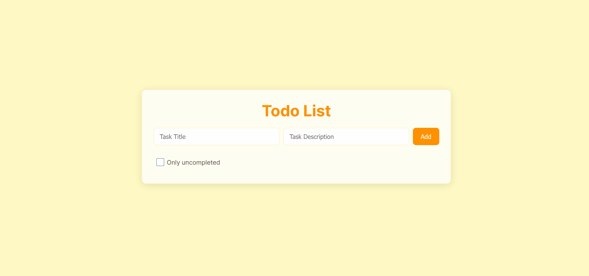
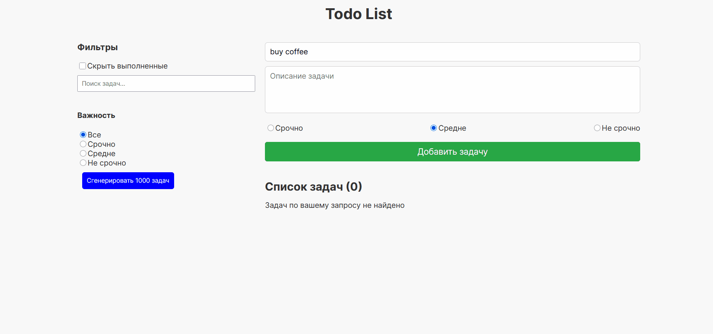
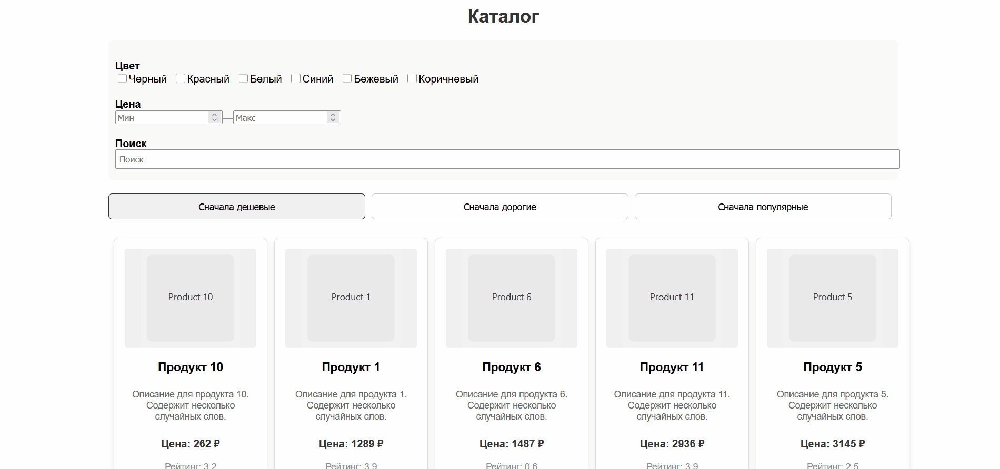
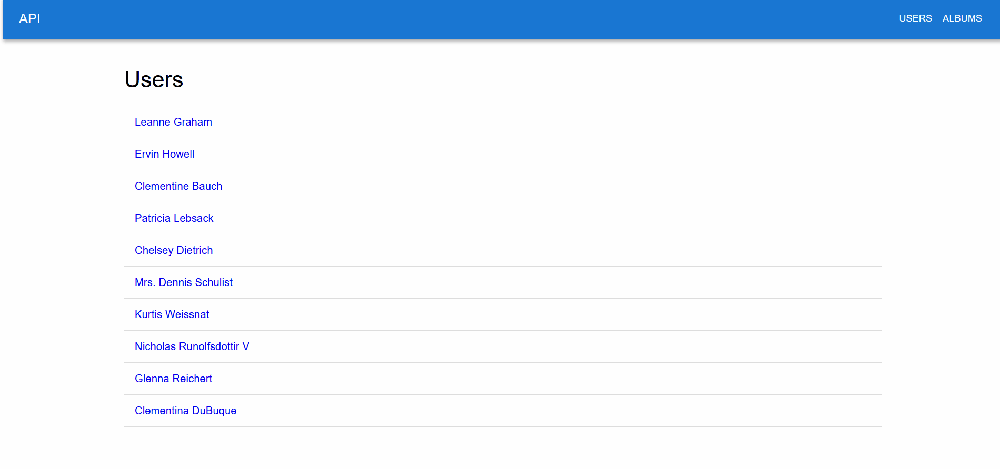
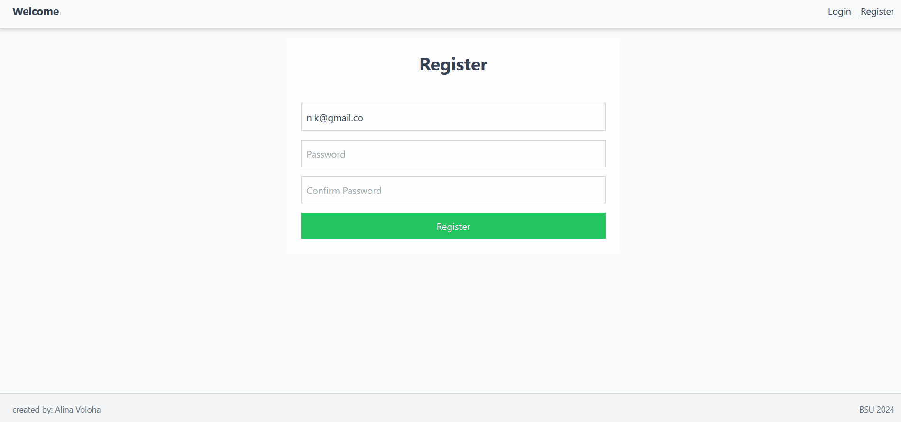

# React Projects

A curated collection of my React apps showing practical skills in **UI development**, **forms & validation**, **routing**, **state management**, and **async API work**.

🌐 Live page: https://alnvoloha.github.io/react-projects/

<p align="center">
  
  
  
  
  
</p>


---

## Start here (suggested order)

1) **Notion Lite (Redux)** — auth + routing + Redux + CRUD + local API  
2) **Product Catalog** — real-world UI patterns: catalog/cards/filters  
3) **API Explorer** — async + loading/error states  
4) **Todo (Filters)** — filters + search + UX details  
5) **Todo (Basic)** — clean fundamentals

---

## Projects

| # | Project | Folder | Skills demonstrated |
|---:|---|---|---|
| 01 | Todo List (Basic) | [`01-react-todo-basic`](./01-react-todo-basic) | controlled inputs, validation, immutable state updates, sorting |
| 02 | Todo List (Filters & Search) | [`02-react-todo-filters`](./02-react-todo-filters) | search, filters, priority views, large list handling |
| 03 | Product Catalog | [`03-react-product-catalog`](./03-react-product-catalog) | reusable UI components, catalog layout, filtering/sorting patterns |
| 04 | API Explorer | [`04-react-api-explorer`](./04-react-api-explorer) | REST requests, loading/error states, error handling, data rendering |
| 05 | Notion Lite (Redux) | [`05-notion-lite-redux`](./05-notion-lite-redux) | Redux architecture, React Router, auth flow, CRUD, Zod validation, JSON Server |

---

## Previews

### 05 — Notion Lite (Redux)
*(сюда вставить GIF: `assets/previews/05-notion-lite-redux.gif`)*

### 03 — Product Catalog
*(сюда вставить GIF: `assets/previews/03-react-product-catalog.gif`)*

### 04 — API Explorer
*(сюда вставить GIF: `assets/previews/04-react-api-explorer.gif`)*

### 02 — Todo (Filters & Search)
*(сюда вставить GIF: `assets/previews/02-react-todo-filters.gif`)*

### 01 — Todo (Basic)
*(сюда вставить GIF: `assets/previews/01-react-todo-basic.gif`)*

---

## Stack


---

## Run locally

Most projects:
```bash
cd <project-folder>
npm install
npm run dev
```

### Notion Lite (Redux) — local API required

Terminal 1 (JSON Server):
```bash
cd 05-notion-lite-redux
npm run dev:db
```

Terminal 2 (frontend):
```bash
npm run dev
```

If there is no script:
```bash
npx json-server --watch db.json --port 5000
```

---

## Repository structure

```
react-projects/
  01-react-todo-basic/
  02-react-todo-filters/
  03-react-product-catalog/
  04-react-api-explorer/
  05-notion-lite-redux/
  docs/                  # GitHub Pages site
  README.md
```

---

## Contact

- Telegram: https://t.me/alinavoloha  
- LinkedIn: https://linkedin.com/in/alina-volokha  
- Email: alinavalokha@gmail.com
